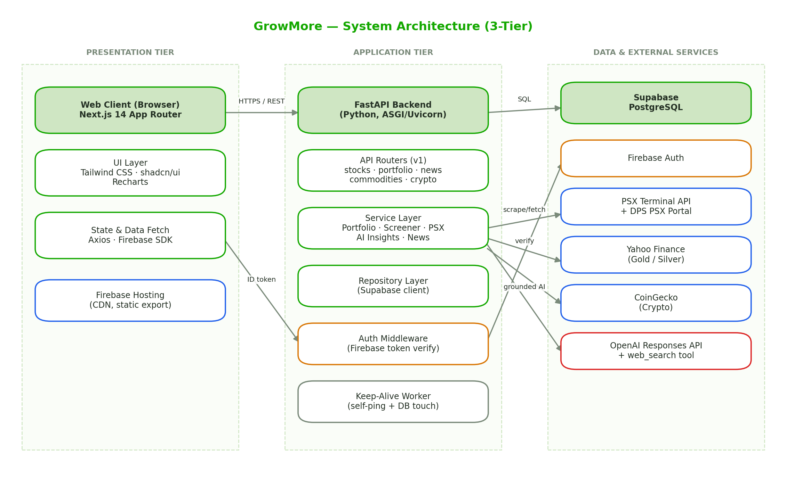
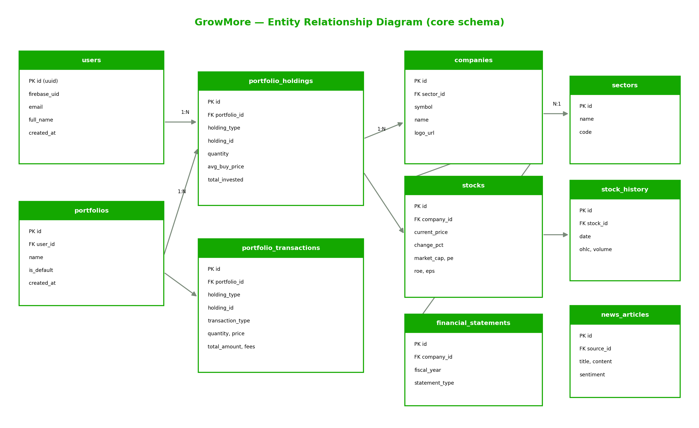

<div align="center">

# 📈 GrowMore

### AI-Powered Multi-Asset Investment Platform for Pakistan

Track **PSX stocks**, **gold & silver**, and **crypto** — plus your entire portfolio — in one dashboard,
with AI insights that cite their sources.

[](https://nextjs.org/)
[](https://react.dev/)
[](https://www.typescriptlang.org/)
[](https://fastapi.tiangolo.com/)
[](https://www.python.org/)
[](https://supabase.com/)
[](https://firebase.google.com/)
[](https://platform.openai.com/)

**[Live Demo](https://grow-more-ai.web.app)** · **[API](https://growmore-yg90.onrender.com)** · **[API Docs](https://growmore-yg90.onrender.com/docs)**

</div>

---

## 📋 Table of Contents

- [About](#-about)
- [Key Features](#-key-features)
- [Architecture](#-architecture)
- [Tech Stack](#-tech-stack)
- [Project Structure](#-project-structure)
- [Getting Started](#-getting-started)
- [Environment Variables](#-environment-variables)
- [API Overview](#-api-overview)
- [Database Schema](#-database-schema)
- [How the AI Works](#-how-the-ai-works)
- [Deployment](#-deployment)
- [Testing](#-testing)
- [Team](#-team)

---

## 🎯 About

A Pakistani retail investor who owns PSX shares, keeps savings in gold, and holds some crypto has to
juggle **three unrelated apps** — none of which combines those holdings into a single portfolio or
explains *why* the market moved.

**GrowMore solves that.** It unifies equities, precious metals, and cryptocurrency into one dashboard
with one portfolio and one P&L figure, and layers on AI analysis that is **grounded in live web search
and always shows its sources**.

> **Problem** → Fragmented tools, hard-to-access PSX data, no unified multi-asset portfolio, unverifiable AI.
> **Solution** → One platform. Live multi-asset P&L. AI that cites real, clickable sources.

**Built as a Final Year Project** at DHA Suffa University (Project Code `P98F25`).

---

## ✨ Key Features

### 💼 Multi-Asset Portfolio
The core of the platform — one portfolio spanning **four asset classes**:

| Capability | Detail |
|---|---|
| **Asset classes** | PSX Stocks · Gold · Silver · Crypto |
| **Live valuation** | Each holding priced from its own source, converted to PKR |
| **P&L tracking** | Unrealized, today's, and realized P&L on sale |
| **Cost basis** | Weighted-average, recomputed on every buy |
| **Buy / Sell** | Review-and-confirm flow with live-but-editable prices |
| **Allocation** | Sector and asset-class breakdown |

Gold and silver are priced in **PKR per tola** (the unit Pakistanis actually buy in), and crypto is
converted from USD at the live exchange rate — so the total is a single meaningful number.

### 📊 Stock Analysis
- **Server-side screener** with numeric filters, sector filters, and saveable strategies
- **9-tab company view** — Overview · Income Statement · Balance Sheet · Cash Flow · Technicals · Ratios · Peers · Activities · AI Insights
- **Technical indicators** computed client-side: RSI, MACD, SMA, EMA, ATR, Bollinger Bands
- **Financial ratios** — ROE, ROA, ROCE, margins, D/E, current ratio, growth
- **☪️ Shariah-compliance** as a first-class, filterable attribute

### 🤖 AI, But Verifiable
Three AI modules, all grounded in **live web search** with real citations:
- **Stock Insights** — sentiment, bull/bear points, catalysts, risks
- **GrowNews** — market news feed with categories and cited sources
- **Commodities Analysis** — gold/silver drivers and outlook

### 🥇 Commodities & 🪙 Crypto
Live gold/silver across **24K / 22K / 21K / 18K** purities in tola, gram and 10-gram, with history
charts — plus a full crypto market view with search and per-coin detail.

### 📈 Plus
Dashboard · Watchlist & price alerts · Investment goals · Broker picks · PSX market activity
(announcements with document links) · Reports exportable to **PDF / CSV / Excel**

---

## 🏗 Architecture

A classic **three-tier** design — presentation, application logic, and data are cleanly separated.

<div align="center">
  
</div>

The backend is strictly layered so business logic stays testable:

```
Router  →  validates input, enforces auth      (app/api/v1/endpoints/)
   ↓
Service →  business logic, no HTTP concerns    (app/services/)
   ↓
Repository → database access only              (app/repositories/)
```

> This separation is why the portfolio engine could be validated end-to-end against live prices
> *without* going through HTTP or authentication.

---

## 🛠 Tech Stack

<table>
<tr><td><b>Frontend</b></td><td>

Next.js 13.5 (App Router) · React 18 · TypeScript · Tailwind CSS · shadcn/ui · Recharts · Zustand · Axios

</td></tr>
<tr><td><b>Backend</b></td><td>

FastAPI · Python 3.13 · Uvicorn · Pydantic

</td></tr>
<tr><td><b>Data & Auth</b></td><td>

Supabase (PostgreSQL) · Firebase Authentication

</td></tr>
<tr><td><b>AI</b></td><td>

OpenAI Responses API + built-in `web_search` tool

</td></tr>
<tr><td><b>Market Data</b></td><td>

PSX Terminal API · PSX Data Portal (dps.psx.com.pk) · Yahoo Finance · CoinGecko

</td></tr>
<tr><td><b>Infra</b></td><td>

Firebase Hosting (frontend) · Render (backend) · GitHub Actions (CI/CD)

</td></tr>
</table>

---

## 📁 Project Structure

A monorepo — backend and frontend live side by side so API changes stay in sync.

```
GrowMore/
├── growmore-backend/              # FastAPI backend (182 REST endpoints)
│   ├── app/
│   │   ├── api/v1/
│   │   │   ├── endpoints/         # Route handlers — one module per domain
│   │   │   │   ├── stocks.py          # Listing, detail, financials, insights
│   │   │   │   ├── portfolio.py       # Portfolios, holdings, /detail, /trade
│   │   │   │   ├── screener.py        # Server-side screening + strategies
│   │   │   │   ├── commodities.py     # Gold/silver prices + AI analysis
│   │   │   │   ├── crypto.py          # Crypto markets & coin detail
│   │   │   │   ├── news.py            # GrowNews AI feed
│   │   │   │   ├── market_activity.py # PSX announcements & payouts
│   │   │   │   ├── dashboard.py       # Aggregated dashboard data
│   │   │   │   ├── exports.py         # PDF / CSV / Excel reports
│   │   │   │   └── ...                # auth, watchlist, goals, admin, health
│   │   │   └── router.py          # Mounts all routers under /api/v1
│   │   │
│   │   ├── services/              # 🧠 Business logic
│   │   │   ├── portfolio_service.py       # Multi-asset engine: pricing, P&L, trades
│   │   │   ├── screener_service.py        # Filter → SQL translation
│   │   │   ├── stock_insights_service.py  # AI insights (web-search grounded)
│   │   │   ├── ai_news_service.py         # GrowNews generation + DB persistence
│   │   │   ├── precious_metals_service.py # Gold/silver → PKR/tola + AI analysis
│   │   │   ├── crypto_service.py          # CoinGecko integration
│   │   │   ├── keep_alive.py              # Free-tier warm-up worker
│   │   │   └── psx/                   # 📡 PSX data-integration layer
│   │   │       ├── client.py              # PSX Terminal API client
│   │   │       ├── dps_client.py          # DPS portal (statements, announcements)
│   │   │       ├── sync_service.py        # daily / full / intraday sync
│   │   │       ├── data_writer.py         # Batch upserts into Supabase
│   │   │       ├── ratios.py              # ROE, ROA, margins, growth
│   │   │       ├── rate_limiter.py        # Respects 100 req/min limit
│   │   │       └── mappers.py             # Raw payload → domain model
│   │   │
│   │   ├── repositories/          # Database access layer
│   │   ├── models/ · schemas/     # Domain models & Pydantic request/response
│   │   ├── core/                  # Dependencies, exceptions, security
│   │   ├── db/supabase.py         # Supabase client (anon + service role)
│   │   ├── config/settings.py     # Pydantic settings from env vars
│   │   └── main.py                # App factory, CORS, lifespan
│   │
│   ├── scripts/                   # Migrations & one-off data jobs
│   │   ├── migrations.sql             # Schema
│   │   ├── fix_sectors.py             # Sector backfill (465 → 58 misclassified)
│   │   ├── backfill_fundamentals.py   # Statements (113 → 485 companies)
│   │   └── compute_ratios.py          # Ratio computation
│   ├── requirements.txt
│   └── render.yaml
│
├── growmore-frontend/             # Next.js frontend (25 routes)
│   ├── app/
│   │   ├── (auth)/                # Login · Register · Forgot password
│   │   ├── (dashboard)/           # Authenticated app shell
│   │   │   ├── dashboard/             # Portfolio + market + AI news overview
│   │   │   ├── stocks/                # Stock list, filters, detail drawer
│   │   │   ├── screener/              # Screener UI
│   │   │   ├── portfolio/             # Multi-asset portfolio + Buy/Sell
│   │   │   ├── commodities/           # Gold & silver + AI insights
│   │   │   ├── crypto/                # Crypto market
│   │   │   ├── news/                  # GrowNews AI feed
│   │   │   ├── broker-picks/          # Broker recommendations
│   │   │   ├── market-activity/       # PSX announcements
│   │   │   └── watchlist/ · goals/ · settings/ · admin/
│   │   ├── layout.tsx
│   │   └── icon.svg               # Brand favicon
│   │
│   ├── components/
│   │   ├── stocks/                # Stock-specific UI
│   │   │   ├── stock-detail-drawer.tsx   # 9-tab bottom drawer
│   │   │   ├── detail/                   # technicals · peers · activities · insights
│   │   │   ├── filters-sidebar.tsx       # Accordion filters
│   │   │   ├── strategies-dropdown.tsx
│   │   │   ├── shariah-badge.tsx
│   │   │   └── stock-logo.tsx            # Logo with fallback chain
│   │   ├── ui/                    # shadcn/ui primitives
│   │   ├── common/ · auth/ · providers/
│   │   └── brand-logo.tsx
│   │
│   ├── lib/
│   │   ├── api.ts                 # Axios instance + Firebase token interceptor
│   │   ├── technicals.ts          # RSI, MACD, SMA, EMA, ATR, Bollinger
│   │   ├── shariah.ts             # Compliance parsing
│   │   └── firebase.ts
│   ├── stores/                    # Zustand stores
│   ├── hooks/ · types/
│   └── package.json
│
├── .github/workflows/             # CI/CD + keep-alive crons
├── docs/                          # Diagrams used in this README
└── README.md
```

---

## 🚀 Getting Started

### Prerequisites
- **Node.js** 18+ and npm
- **Python** 3.11+ (3.13 recommended)
- A **Supabase** project, a **Firebase** project, and an **OpenAI** API key

### 1 · Clone

```bash
git clone https://github.com/Haris357/GrowMore.git
cd GrowMore
```

### 2 · Backend

```bash
cd growmore-backend
python -m venv venv

# Windows
venv\Scripts\activate
# macOS / Linux
source venv/bin/activate

pip install -r requirements.txt
cp .env.example .env        # then fill in your keys (see below)
uvicorn app.main:app --reload
```

Backend runs at **http://localhost:8000** — interactive docs at **/docs**.

### 3 · Database

Run the schema in your Supabase SQL editor:

```bash
growmore-backend/scripts/migrations.sql
```

Then (optionally) seed market data:

```bash
python scripts/seed_all_psx_stocks.py
python scripts/backfill_fundamentals.py
python scripts/fix_sectors.py
python scripts/compute_ratios.py
```

### 4 · Frontend

```bash
cd growmore-frontend
npm install
cp .env.example .env.local  # fill in your keys
npm run dev
```

Frontend runs at **http://localhost:3000**.

---

## 🔐 Environment Variables

<details>
<summary><b>Backend</b> — <code>growmore-backend/.env</code></summary>

```env
# Supabase
SUPABASE_URL=https://<project-ref>.supabase.co
SUPABASE_KEY=<anon-key>
SUPABASE_SERVICE_KEY=<service-role-key>

# Firebase Admin (auth verification)
FIREBASE_PROJECT_ID=<project-id>
FIREBASE_CLIENT_EMAIL=<service-account-email>
FIREBASE_PRIVATE_KEY="<service-account-private-key>"

# AI
OPENAI_API_KEY=<your-openai-key>
OPENAI_MODEL=gpt-4.1-mini

# Optional market-data keys
COINGECKO_API_KEY=
NEWSAPI_KEY=

# App
APP_ENV=development
DEBUG=true
CORS_ORIGINS=http://localhost:3000
```
</details>

<details>
<summary><b>Frontend</b> — <code>growmore-frontend/.env.local</code></summary>

```env
NEXT_PUBLIC_API_URL=http://localhost:8000/api/v1

NEXT_PUBLIC_FIREBASE_API_KEY=<key>
NEXT_PUBLIC_FIREBASE_AUTH_DOMAIN=<project>.firebaseapp.com
NEXT_PUBLIC_FIREBASE_PROJECT_ID=<project-id>
NEXT_PUBLIC_FIREBASE_STORAGE_BUCKET=<project>.appspot.com
NEXT_PUBLIC_FIREBASE_MESSAGING_SENDER_ID=<sender-id>
NEXT_PUBLIC_FIREBASE_APP_ID=<app-id>
```
</details>

> ⚠️ **Never commit `.env` files.** The service-role key bypasses Row-Level Security.

---

## 🔌 API Overview

Base URL: `/api/v1` — full interactive docs at **`/docs`**.

| Method | Endpoint | Description |
|---|---|---|
| `GET` | `/stocks` | Paginated PSX stock list |
| `GET` | `/stocks/{id}` | Stock detail with fundamentals |
| `GET` | `/stocks/{id}/financials` | Income, balance sheet, cash flow |
| `GET` | `/stocks/{id}/insights` | 🤖 AI insights with cited sources |
| `POST` | `/screener/run` | Server-side screening |
| `GET` | `/screener/strategies` | Pre-built strategies |
| `GET` | `/portfolios` | User's portfolios |
| `GET` | `/portfolios/{id}/detail` | **Live multi-asset valuation + P&L** |
| `POST` | `/portfolios/{id}/trade` | **Buy / sell any asset class** |
| `GET` | `/portfolios/{id}/transactions` | Transaction history |
| `GET` | `/commodities/prices` | Gold & silver in PKR/tola |
| `GET` | `/commodities/analysis` | 🤖 AI metals analysis + sources |
| `GET` | `/crypto/markets` | Crypto market data |
| `GET` | `/news/ai` | 🤖 GrowNews feed (`?refresh=true` to regenerate) |
| `GET` | `/market/activity` | PSX announcements |
| `GET` | `/exports/portfolio/{pdf\|csv\|excel}` | Reports |
| `GET` | `/health` | Health check |

---

## 🗄 Database Schema

<div align="center">
  
</div>

**Design note — polymorphic holdings.** A single `portfolio_holdings` table stores *every* asset class,
discriminated by `holding_type` (`stock` | `gold` | `silver` | `crypto`). Since `holding_id` is a
non-nullable UUID, deterministic `uuid5` values are derived for assets with no natural DB id — metals
from a fixed namespace, crypto from the CoinGecko coin id (also kept for price resolution).

➕ **A new asset class needs no schema migration** — only a price resolver.

---

## 🤖 How the AI Works

Most apps let an LLM free-associate about markets. GrowMore doesn't.

```
User request
     ↓
OpenAI Responses API  ──  web_search tool enabled
     ↓
Model performs LIVE web search, must cite inline
     ↓
Backend extracts url_citations from response annotations
     ↓
Inline citation markup stripped from display text
     ↓
UI renders analysis + clickable source chips
```

Every claim traces to a real, checkable source.

**Persistence matters.** Generated content is stored in Postgres and served from there; the model only
re-runs on an explicit **Refresh**:

| | Latency | Inference cost |
|---|---|---|
| Generate (refresh) | 17.6 s | 1 call |
| Load from DB (normal page view) | **0.3 s** | **0 calls** |

That's **~59× faster** and removes per-view cost entirely.

---

## ☁️ Deployment

| Component | Platform | Notes |
|---|---|---|
| Frontend | Firebase Hosting | `npm run build && firebase deploy` |
| Backend | Render | Auto-deploys on push to `main` |
| Database | Supabase | Managed PostgreSQL |

### Keeping free tiers awake
Render suspends a service after **15 min** idle; Supabase pauses a project after **7 days**. Internal
background work doesn't count as traffic, so `.github/workflows/` contains scheduled crons that ping
`/health` and Supabase, backed by an in-process `keep_alive.py` worker.

> Requires repo variables `RENDER_URL`, `SUPABASE_URL` and secret `SUPABASE_ANON_KEY`.

---

## 🧪 Testing

Full test plan: **`GrowMore-Test-Plan-and-Cases (Updated).docx`** — 9 modules, 37 test cases.

| Module | Cases | Result |
|---|---|---|
| Authentication · Stock List · Screener · Commodities | 16 | ✅ Pass |
| Crypto · GrowNews · Portfolio · Alerts · Broker Picks | 21 | ✅ Pass |
| **Total** | **37** | **100%** |

```bash
# Backend
cd growmore-backend && python -m compileall app

# Frontend
cd growmore-frontend && npm run typecheck && npm run build
```

---

## 👥 Team

DHA Suffa University — Department of Computer Science · FYP `P98F25`

| Member | Role |
|---|---|
| **Haris Muhammad Imran** | Team Lead — Backend & AI |
| **Abdullah Akhter** | Frontend Developer |
| **Azmeer Khan** | QA & Domain Analyst |
| **Hamza Siddiqui** | Documentation & Testing |

**Supervisor:** Mr. Arsal

---

## ⚠️ Disclaimer

GrowMore is an **educational and informational** tool. It does **not** provide investment advice, and it
does not execute trades. Market data is delayed and sourced from third parties. AI-generated analysis is
decision *support* — always verify against the cited sources before acting. Invest at your own risk.

---

<div align="center">

Built with care for Pakistani investors 🇵🇰

</div>
